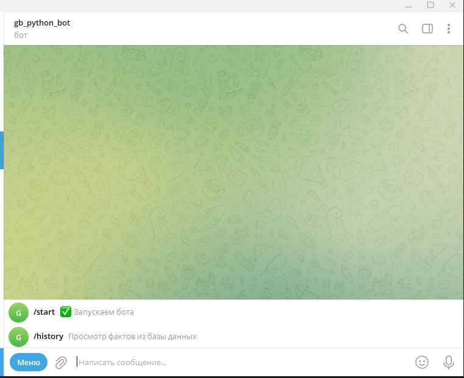
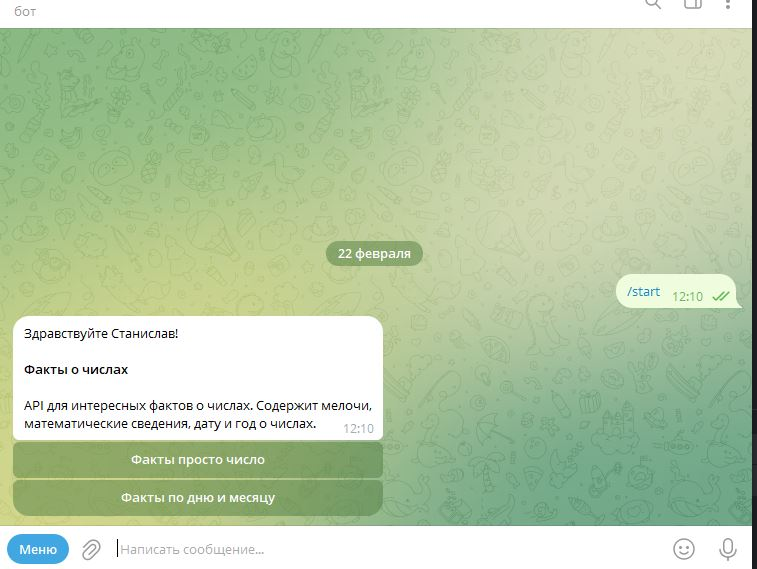
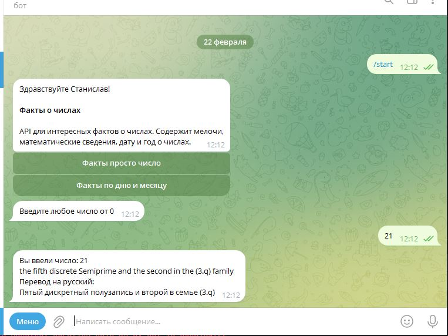
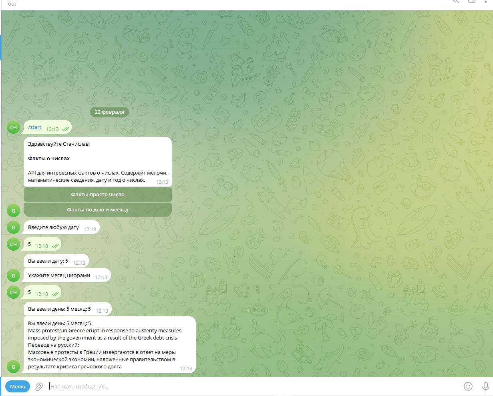

## Телеграм бот (факты о числах)
бот написан на библиотеке aiogram 3 берет данные с сайта https://rapidapi.com/  и реализован перевод
также реализована сохранение данных с помощью библиотеки peewee
  
### При нажатии в меню на /start появляется приветствие с двумя кнопками
«Факты просто число»
«Факты по дню и месяцу»
Смотрите картинки ниже

### При нажатии в меню на /history выводится последние 10 фактов (смотри картинку ниже)
